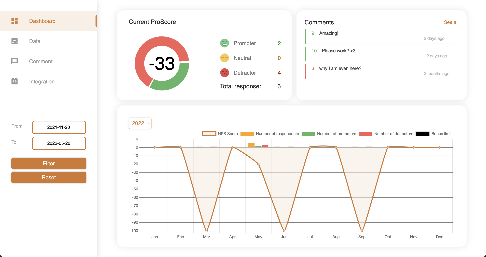
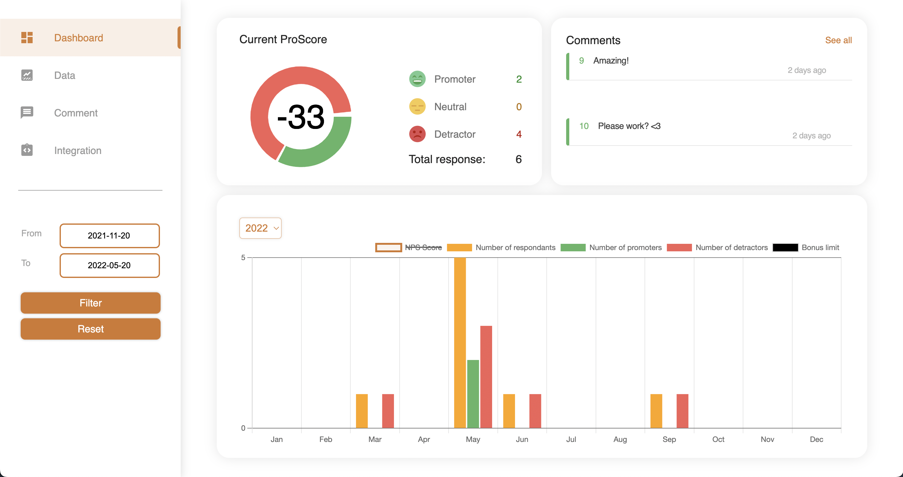
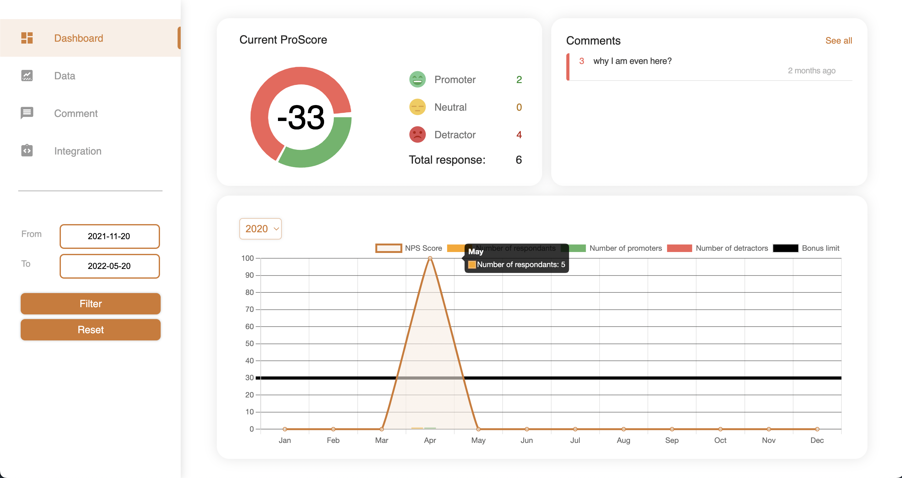
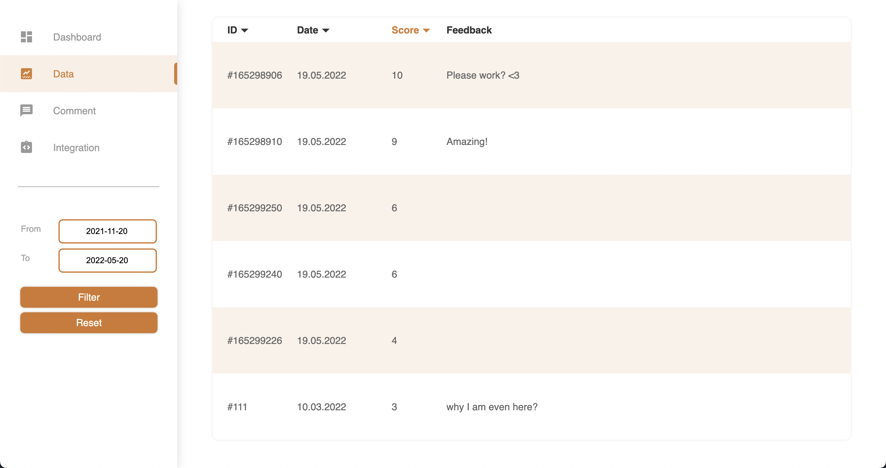
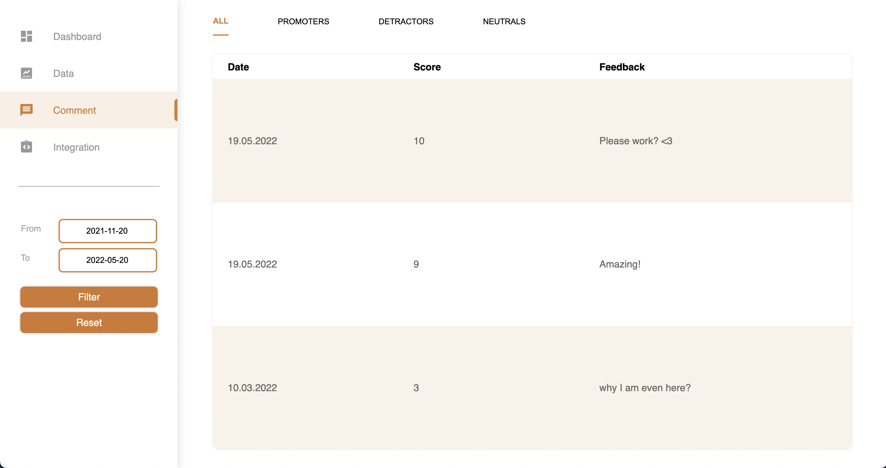
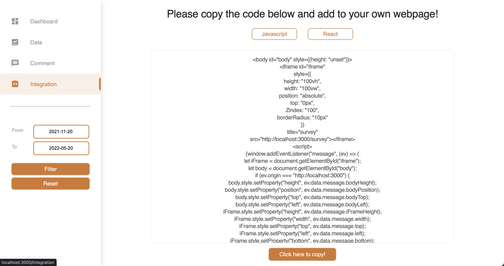

# PHZ NPS Dashboard

## 1. Project Description

Business College Helsinki school project with PHZ Full Stack. The dashboard displays the information about the employees satisfaction at the work place.

### 1.1. Business Vision

To make easy to use and clear dashboard for HR and CEO to access the information collected from employees about the satisfaction of working in the work place.
All the vital information about the current NPS, feedbacks and NPS Trend can be found from one page.

### 1.2. Task Management

- Jira
- Slack
- Teams
- GitHub

### 1.3. Personas

- Mahalete Haile @Mahalete
- Rakhi Chirayil Chandran @rakhicc
- Trang Nguyen @nguyenminhtrang2206
- Maria Rosenholm @MariaRosenholm

### 1.4. Use Cases

- Based on employees responses they are placed into three categories: Neutrals, Promotors and Detractors.
- NPS is calculated by Subtracting the percentage of Detractors from the percentage of Promoters
- HR can see the latest feedbacks and act accordingly
- CEO can see the NPS and based on that pay bonuses to HR
- By following the NPS Trend HR and CEO can find out if the actions they have they taken have been efficient

[Read more!](https://www.netpromoter.com/know/)

## 2. Architecture

### 2.1. Technologies

Coding languages/frameworks/testing

- React
  - Axios
  - Chart.js
  - Moment
  - DatePicker
- CSS
- Jest

## 3. Development Environment

### 3.1. Prerequisites

In the environmental variables you should have:

```.env
REACT_APP_URL=BACKENDURL/api/npsdata
REACT_APP_SURVEY_URL=SURVEYURL
```

### 3.2. Start the Application

After pulling the newest code from Git.

- npm install
- .env file in the root
- npm start

### 3.3. Run Tests

- npm test

## 4. Deployment

### 4.1. Prerequisites

To deploy you need to have:

- npm
- node

In the environmental variables you should have:

```.env
REACT_APP_URL=BACKENDURL/api/npsdata
REACT_APP_SURVEY_URL=SURVEYURL
```

## Screenshots







